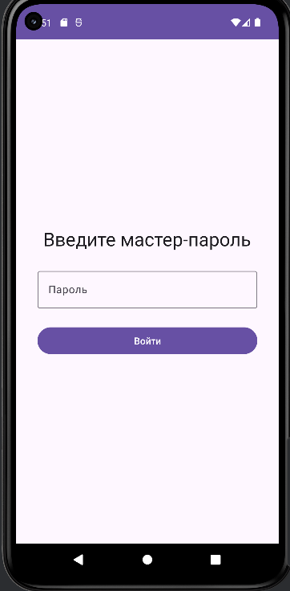
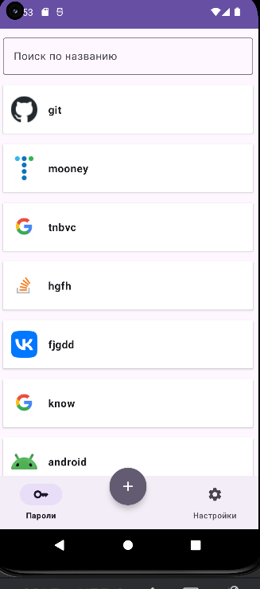
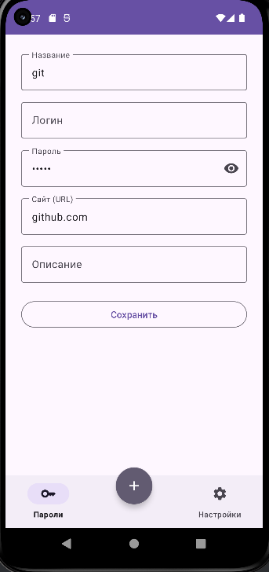
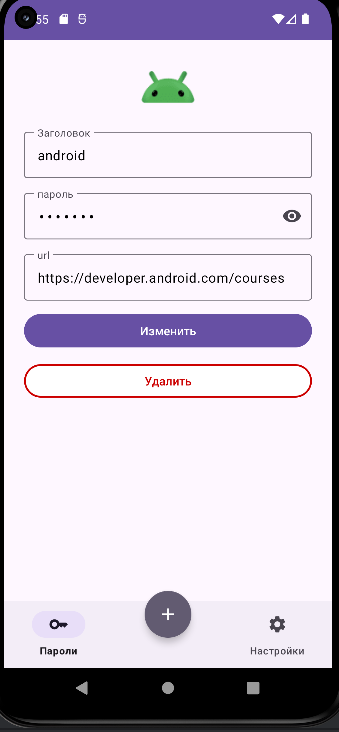
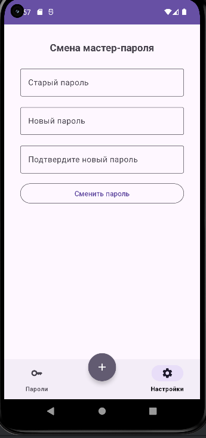

# Password Manager

**Password Manager** — это Android-приложение для безопасного хранения и управления паролями с поддержкой мастер-пароля, локального шифрования (KeyStore), поиска и простого UI.

---

## Возможности

- **Мастер-пароль**: обязательная установка при первом запуске.
- **Хранение паролей**: названия, логины, пароли, ссылки, описания.
- **Шифрование**: все пароли шифруются с помощью Android KeyStore.
- **Поиск по названию.**
- **Изменение и удаление записей.**
- **Копирование логина/пароля/URL в буфер обмена** одним касанием.
- **Изменение мастер-пароля** через настройки.
- **Современный UI** с Material Components, BottomNavigation и FAB.
- **Пагинация** и shimmer для плавного UX.

---

## Архитектура

- **Чистая архитектура (Clean Architecture)**: `data` / `domain` / `presentation`
- **DI**: Dagger 2 — разбивка на `AppComponent`, `DataComponent`, `DomainComponent`, `PresentationComponent`
- **Room** для локального хранения данных
- **MVVM** + LiveData/StateFlow
- **Тесты**: JUnit, MockK

---

## Шифрование

- Используется **Android KeyStore** (`AES/GCM/NoPadding`, `SecretKey`)
- Мастер-пароль **не хранится в базе**. Он служит для генерации или проверки ключа в KeyStore
- Пароли **шифруются при сохранении** и **расшифровываются только в памяти** устройства

---

## Стек технологий

- **Kotlin**
- **Android Jetpack** (Room, ViewModel, LiveData, Navigation)
- **Dagger 2**
- **Paging 3**
- **Material Components**
- **JUnit**, **MockK** для тестов

---

## Основные экраны

- **AuthFragment** — Вход/установка мастер-пароля
- **PasswordsFragment** — Список паролей с поиском
- **AddEditPasswordFragment** — Добавление/редактирование записи
- **PasswordDetailsFragment** — Детали, копирование, удаление, переход к редактированию
- **SettingsFragment** — Изменение мастер-пароля

---

## Скриншоты

[Скачать APK](https://github.com/ByteTheKernel/password-manager/releases/download/v1.0.0/app-debug.apk)

